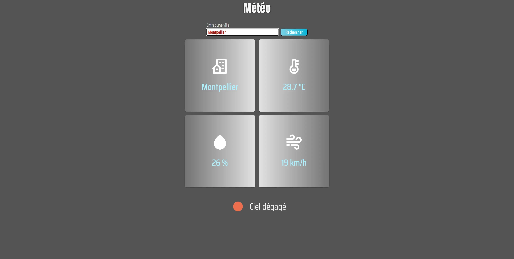

# WeatherNow - Weather Search Web App

A simple web app to check current weather conditions by city name. Get real-time weather information including temperature, humidity, and wind speed.

## Table of Contents

- [Description](#description)
- [Installation](#installation)
- [Usage](#usage)
- [Screenshots](#screenshots)
- [Contact](#contact)

## Description

WeatherNow is a weather search web app built using HTML, CSS, and JavaScript. It fetches weather data from the OpenWeatherMap API based on the user's input city name and displays current weather conditions, temperature, humidity, and wind speed.

## Installation

1. Clone the repository: `git clone https://github.com/Arkodarkk/Weather_Now.git`
2. Navigate to the project directory: `cd Weather_Now`

## Usage

1. Open `index.html` in your web browser.
2. Enter a city name in the input field and click "Rechercher."
3. The app will display the current weather details for the entered city.

## Screenshots

Insert your project's screenshots here.

## Contact

If you have any questions, suggestions, or feedback, feel free to contact me:

- Email: codecrushcontact@gmail.com
- GitHub: [Arkodarkk](https://github.com/Arkodarkk)
